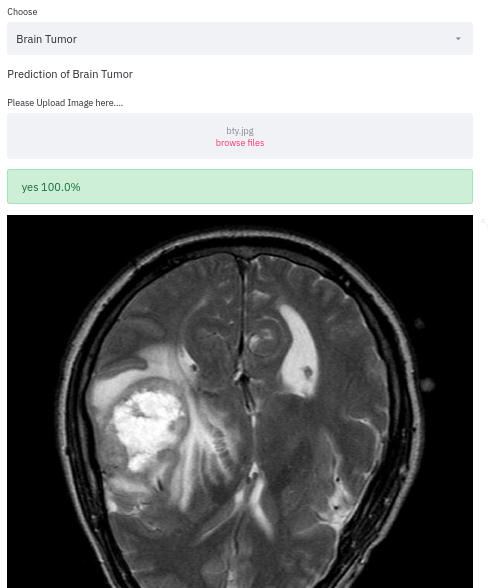
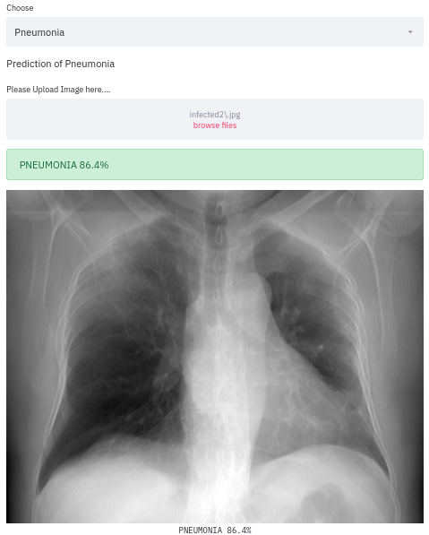
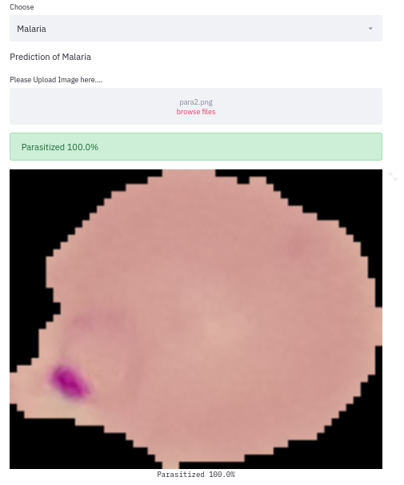

# Health_Webapp
One website for detection of Brain Tumor, Pneumonia and Malaria. 

### Deployed WebApp link
`https://wpnx-myhealth.herokuapp.com/`

#### Brain Tumor Detection

#### Pnumonia Detection

#### Malaria Detection

### Select What you want to detect ? and upload the image.
#### For Pnumonia upload Chest xray
#### For Brain Tumor Upload the MRI scan of Brain
#### For Malaria upload the Upload the cell images

### How to install Dependencies
#### `$ pip install -r requirements.txt`

### How to run website Locally
#### `$ streamlit run app.py`
