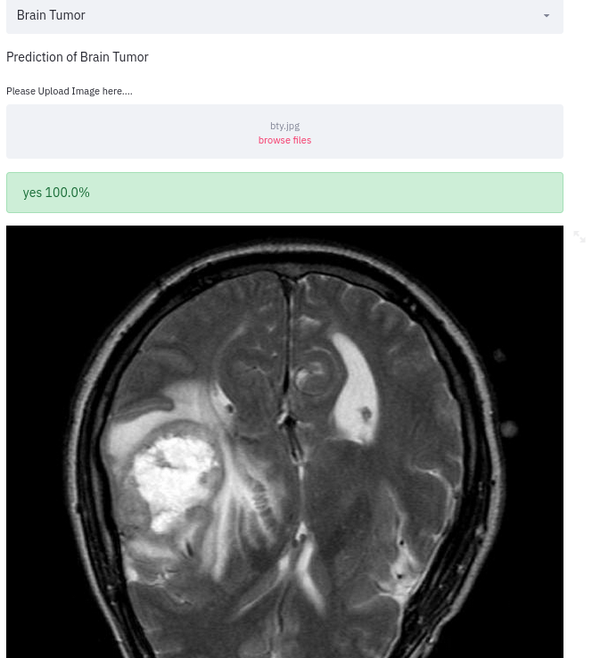
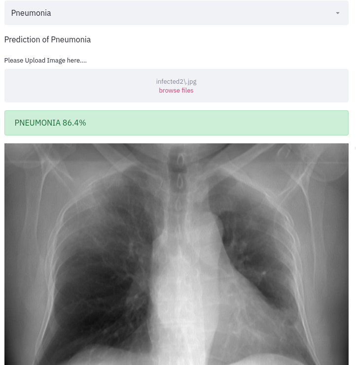
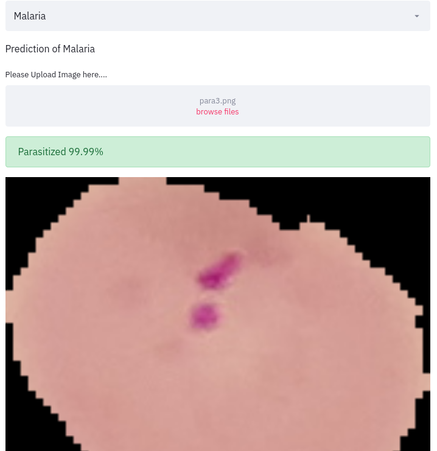

# Health_Webapp
One website for detection of Brain Tumor, Pneumonia and Malaria. 
Upload The image in (jpeg, jpg, png) format
For Pnumonia detection upload the chest Xray, for Brain Tumor detection upload the Brain MRI image
 
### Deployed WebApp link
https://wpnx-myhealth.herokuapp.com/

#### #Brain Tumor Detection

#### #Pnumonia Detection

#### #Malaria Detection

### Select What you want to detect ? and upload the image.
`For Pnumonia Detection upload Chest xray`
#
`For Brain Tumor Detection Upload the MRI scan of Brain`
#
`For Malaria Detection upload the blood cell images`

### How to install Dependencies
#### `$ pip install -r requirements.txt`

### How to run website Locally
#### `$ streamlit run app.py`
